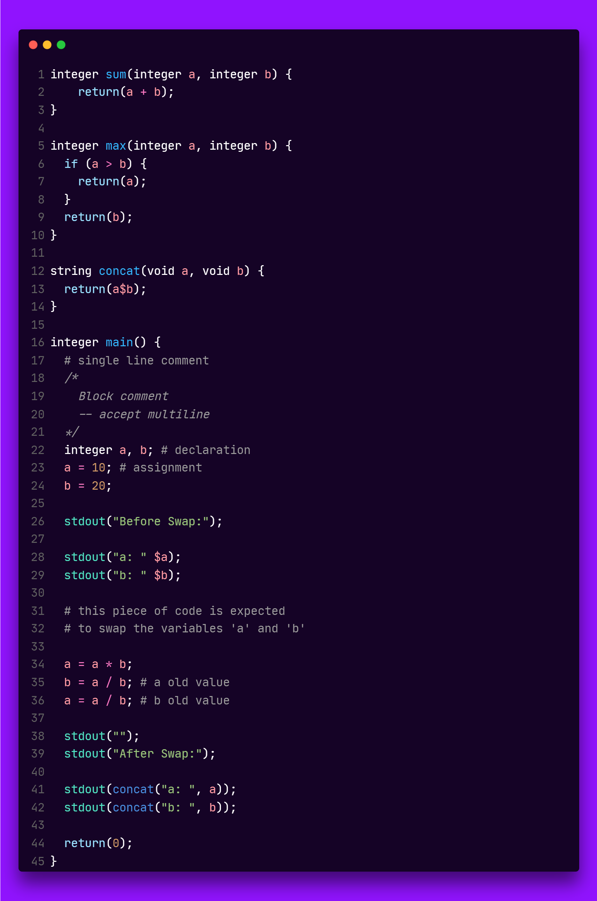

# K Language

### Run

To run a program, just use the compiler as python module:

```shell
$ python -m compiler ./demo/simple_program.k
```

### Unit Tests

```shell
$ python -m pytest -v --no-header
```

### Demo



### EBNF
```
TOP_LEVEL = { STATEMENT } ;

BLOCK = "{" , { STATEMENT }, "}" ;

TYPE = "integer" | "string" | "void";

IDENTIFIER_DECLARATION = TYPE , IDENTIFIER ;

FUNCTION_DEFINITION = TYPE , IDENTIFIER , "(" [ , TYPE, IDENTIFIER [ , { "," , TYPE, IDENTIFIER } ] ] , ")" , FUNCTION_BODY;

FUNCTION_BODY = "{" , { STATEMENT }, [ , FUNCTION_RETURN ] , "}";

FUNCTION_RETURN = "return", EXPRESSION ;

FUNCTION_CALL = IDENTIFIER , "(" [ , IDENTIFIER [ , { "," , IDENTIFIER } ] ] , ")" ;

STATEMENT = ( λ | IDENTIFIER_DECLARATION | FUNCTION_DEFINITION | FUNCTION_CALL | ASSIGNMENT | BLOCK | WHILE_STATEMENT | IF_STATEMENT ), ";";

FACTOR = ( NUMBER | IDENTIFIER | FUNCTION_CALL | ( UNNARY_OPERATOR , FACTOR ) | "(" , CONDITIONAL , ")" );

TERM = FACTOR, { ("\*" | "/" | "and"), FACTOR } ;

EXPRESSION = TERM, { ("+" | "-" | "or"), TERM } ;

CONDITIONAL = EXPRESSION , { ("<" | "<=" | "==" | "!=" | ">=" | ">" ) , EXPRESSION } ;

WHILE_STATEMENT = "while" , "(" , CONDITIONAL , ")" , BLOCK ;

IF_STATEMENT = "if" , "(" , CONDITIONAL , ")" , BLOCK , [ "else" , BLOCK ] ;

ASSIGNMENT = IDENTIFIER, "=" , EXPRESSION ;

IDENTIFIER = LETTER, { LETTER | DIGIT | "_" } ;

UNNARY_OPERATOR = ( "+" | "-" | "not" ) ;

NUMBER = DIGIT [ { , DIGIT } ] ;

LETTER = ( "A" | "B" | "C" | "D" | "E" | "F" | "G" | "H" | "I" | "J" | "K" | "L" |
"M" | "N" | "O" | "P" | "Q" | "R" | "S" | "T" | "U" | "V" | "W" | "X" |
"Y" | "Z" | "a" | "b" | "c" | "d" | "e" | "f" | "g" | "h" | "i" | "j" |
"k" | "l" | "m" | "n" | "o" | "p" | "q" | "r" | "s" | "t" | "u" | "v" |
"w" | "x" | "y" | "z" ) ;

DIGIT = ( "1" | "2" | "3" | "4" | "5" | "6" | "7" | "8" | "9" | "0" ) ;
```